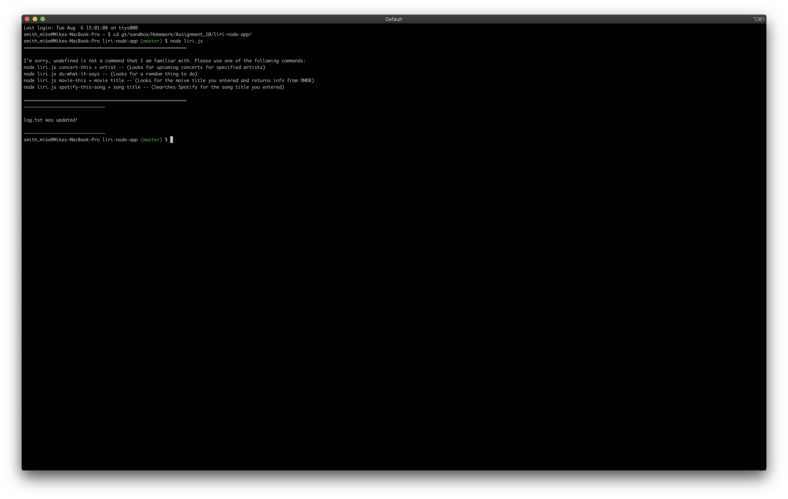
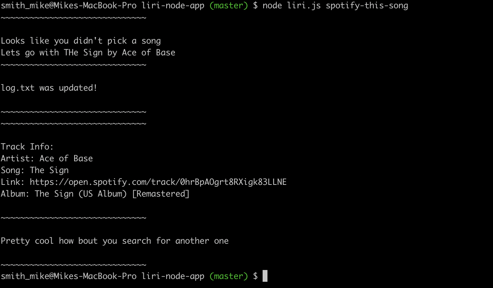
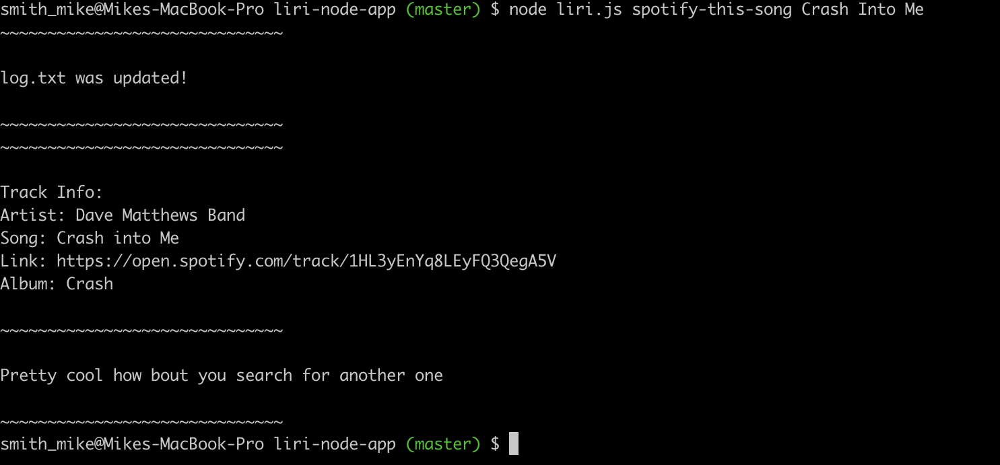
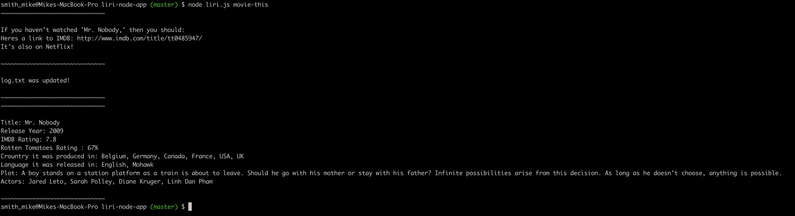
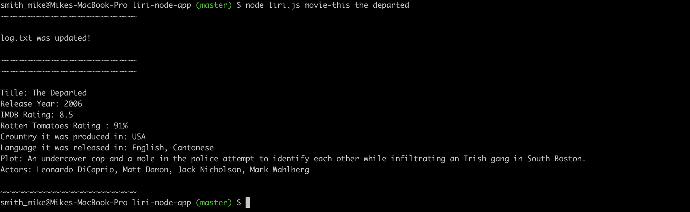
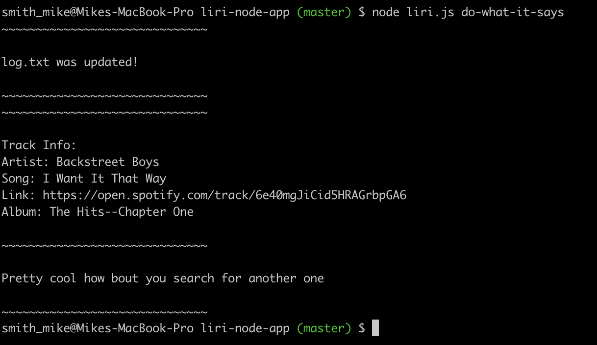

#Liri-Node-App Documentation 

##Description

Liri is a Node.js app that depends on user input from the command line 

Integrated Spotify, Bandsintown and OMDb APIs return information based in specific user input

##The following specific commands will return searc results from the API’s:

liri node “concert-this” - to return recent band info and tour dates from Bandsintown API. 
liri node “spotify-this-song” and a “song-name” - to return search results based on the song-name entry.  , 
liri node “movie-this” and a “movie-name” - to return search results based on the movie-name entry. , 
liri node “do-what-it-says” - to access and execute the data command in the random.txt file. 

##Technologies Used

Node.js
JavaScript
Bandsintown API (via axios)
Spotify API (via spotify npm module)
OMDb API (via axios)

##You’ll need these Node packages to run this app in the command line

Axios: https://www.npmjs.com/package/axios
Node-Spotify-API: https://www.npmjs.com/package/node-spotify-api
Bands in Town API: http://www.artists.bandsintown.com/Bandsintown-api
OMDB API: http://www.omdbapi.com
Moment: https://www.npmjs.com/package/moment
Request: https://www.npmjs.com/package/request
DotEnv: https://www.npmjs.com/package/dotenv

##Code Explanation

Links to authentication keys for Spotify are stored in “keys.js”, and we are exporting its contents to the main “liri.js” file.
What our app does depends on what the user types, and there are 4 main functions: (1) prints latest concert info, (2) Spotify lookup for a song, (3) OMDb lookup for a movie, and (4) read command and query from another file.

The program makes a request to the Bandsintown API that is limited by parameter band name and we get back a JSON object that includes an array of the band info output using console.log.

The program also makes a request to the Spotify API, and we get back a JSON object that includes artist(s), song, preview link, and album info.

The program also makes an HTTP request to the OMDb API using the request NPM module, and we get back a JSON object that includes Movie Title,Year, IMDb Rating, Language, Country, Plots, Actors and Rotten Tomatoes Rating.

The program also reads from a file called “random.text” and executes the command and logged there using string and array methods.
Appropriate pseudo coding and error-checking has been added.